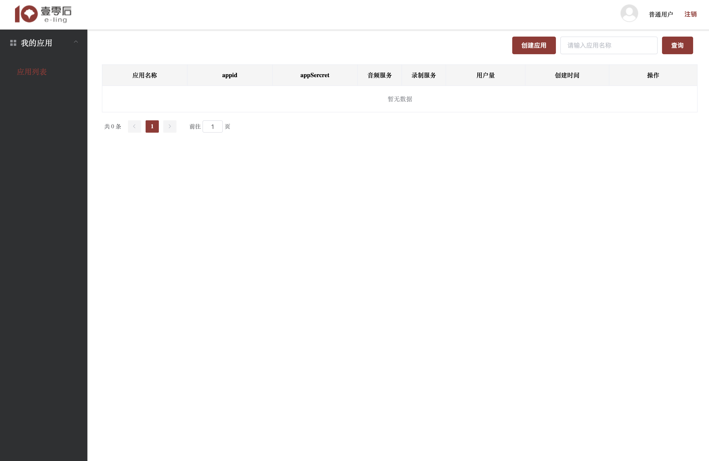

# 注册并创建应用

## 注册开发者账号

**第一步：**进入 `ElingIM` [开发者注册及管理后台](https://im.e-lingcloud.com)，点击 “注册”，进入开发者管理后台注册页面。

  

 

**第二步：**在注册页面中，先填入邮箱，然后点击 “发送验证码”，我们会向您填写的邮箱中发送验证码。输入您收到的验证码并设置好密码，然后点击 “注册” 按钮，即可完成注册。

 

## 创建应用

注册成功后，回到控制台登录页面，然后登录到开发者后台。

**第一步：**点击 “创建应用” 按钮，如下图：

 

**第二步：**填写创建应用的相关信息，如下图：

> 注：Bundle ID 是您项目中的 Bundle Identifier，用来唯一标识一个 App。此处填写的是 "Explicit App ID"，不可带通配符。建议填写反向域名风格的字符串。

 

**第三步：**填写完应用信息后，点击 “创建” 按钮。应用创建成功后，系统会为您生成 `appid` 、`appSecret` 以及相关配置信息，如下图：

