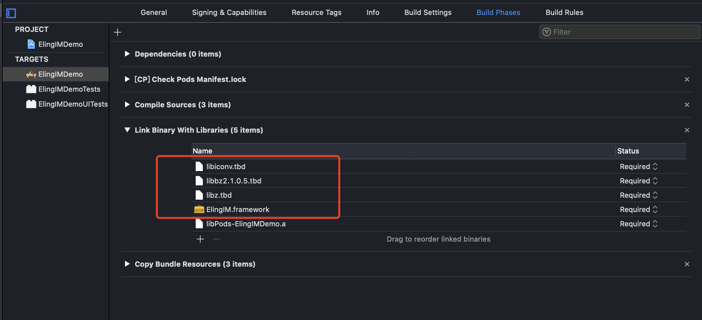
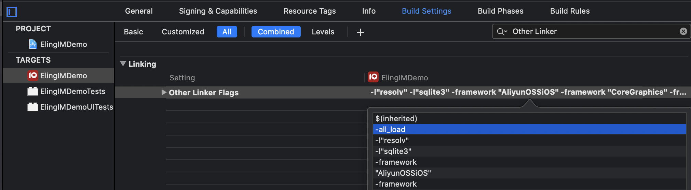
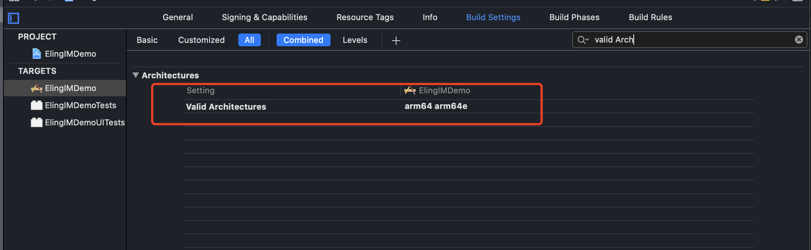

# 手动导入SDK

## 1.1 下载SDK
<a href="../assets/files/sdk.zip" download="ios_im_sdk_v1.0.0.zip" target="_blank"> 下载SDK </a>，其中包括

```objc
ElingIM.h
ElingIM.framework
```

<br/>

## 1.2 导入SDK
### 添加到项目中
将下载下来的库文件添加到工程的目录下，并勾选截图中标注的三项。


<br />

### 设置工程属性

向 `Build Phases` ➙ `Link Binaries With Libraries` 中添加SDK所依赖的库文件。



<br />

设置 `Building Settings` ➙ `Enable Bitcode` 为 `NO`。


<br />

向 `Building Settings` ➙ `Other Linker Flags` 中添加 `-all_load` 或 `-force_load` 选项。



<br />

修改项目架构。设置 `Building Settings` ➙ `Valid Architectures` 为 `arm64 arm64e`。



<br />

### 添加 `SDK` 所依赖的第三方 `pod` 库。

在项目的 `Podfile` 文件中添加以下行：

```ruby
  pod 'XCMacros', '~> 1.0.5'
  pod 'FMDB', '~> 2.7.5'
  pod 'MJExtension', '~> 3.2.1'
  pod 'AliyunOSSiOS', '~> 2.10.8'
  pod 'XCDateUnit', '~> 0.0.5'
  pod 'XCApplicationHelper', '~> 0.0.1'
  pod 'XCCategory', '~> 1.0.8'
```

进入到 `Podfile` 所在的目录，执行以下命令：
```zsh
pod install
```

执行完命令后，打开工程文件运行即可。