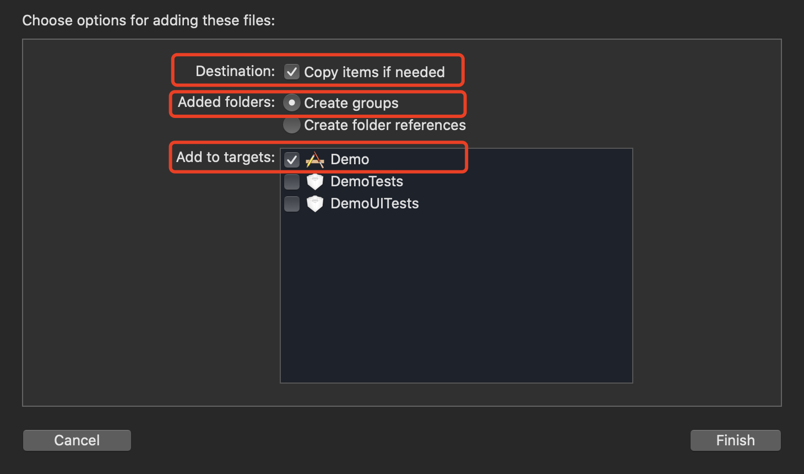

# 手动导入SDK

## 1.1 下载SDK
[下载SDK]()，其中包括
```objc
libElingIM.a
ELClient.h
ELUserManager.h
ELLoginManager.h
ELChatManager.h
ELGroupManager
ELCallManager.h
ELContactManager.h
ELConversation.h
ELMessage.h
ELMessageBody.h
ELTextMessageBody.h
ELFileMessageBody.h
ELImageMessageBody.h
ELVoiceMessageBody.h
ELVideoMessageBody.h
ELCallMessageBody.h
ELVideoCallMessageBody.h
ELAudioCallMessageBody.h
ELGroup.h
ELUserInformation.h
```

<br/>

## 1.2 导入SDK
将下载下来的库文件添加到工程的目录下，并勾选截图中标注的三项。



<br />

设置工程属性

向 `Build Phases` ➙ `Link Binaries With Libraries` 中添加SDK所依赖的库文件。

